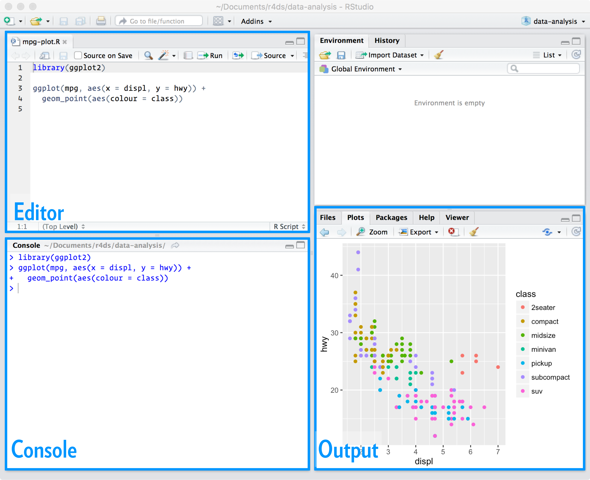

A linguagem `R` é um tanto quanto intuitiva, muita coisa sai do jeito certo no 
chute! Para ver um exemplo disso, é interessante começar fazendo do R uma grande calculadora. Tente jogar no console `2*2 - (4 + 4)/2`. Pronto. Com essa simples 
expressão você já é capaz de imaginar (e certeiramente) como pedir ao R para fazer qualquer tipo de operação aritmética. Lição aprendida!

Além do mais, as operações e suas precedências são mantidas como na matemática, 
ou seja, divisão e multiplicação são calculadas antes da adição e subtração. 
E os parênteses nunca são demais!

## RStudio

Talvez você tenha imaginado qual seria o resultado da operação, mas ainda não 
tenha conseguido calcular usando o R, porque você não sabe onde digitar aquilo, 
por isso vamos apresentar o RStudio.

O RStudio é um (o melhor) IDE (*integrated development environment*) para o R.
E você pode fazer o download [aqui](https://www.rstudio.com/products/rstudio/download3/). 
Estamos assumindo que você já instalou o próprio R. Se não instalou, [clique aqui](https://cloud.r-project.org/).

Assim que abrir o RStudio você verá a seguinte tela.




Nela estão dispostos **editor**, **console**, **environment** e **output**. 
Normalmente eles vêm nesta ordem, depois você pode organizá-los da forma que
preferir. Preste atenção a todos esses campos durante este tutorial.

Agora que você já conhece o RStudio, digite a expressão `2*2 - (4 + 4)/2` no
**console** e tecle `Enter`. Uma outra forma de chamar uma expressão é escrever
o código no **editor** e teclar `Ctrl + Enter`. Assim o comando é enviado para 
o **console** onde é diretamente executado.

## Usando o console

Pelo console é possível executar qualquer comando do R.


```r
1:30
##  [1]  1  2  3  4  5  6  7  8  9 10 11 12 13 14 15 16 17 18 19 20 21 22 23
## [24] 24 25 26 27 28 29 30
```

Esse comando é uma forma simplificada de criar um vetor de inteiros de 1 a 30.
Você pode ignorar esses números que aparecem entre parênteses, na verdade eles 
só indicam o índice do primeiro elemento impresso nessa linha.

<div class='admonition note'>
<p class='admonition-title'>
Quando compilamos?
</p>
<p>
Quem vem de linguagens como o C ou Java, espera que seja necessário compilar o código em texto para o código de máquinas (geralmente um código binário). No R, isso não é necessário. O R é uma linguagem de programação dinâmica que interpreta o seu código enquanto você o executa.
</p>
</div>

Se você digitar um comando incompleto, como `5 + ` e apertar `Enter`, o R irá mostrar
um `+`, o que não tem nada a ver com somar alguma coisa, e sim significa que o
R está esperando que você complete o seu comando. Termine o seu comando ou aperte
`Esc` para recomeçar.

```
> 5 -
+ 
+ 5
[1] 0
```

Se você digitar um comando que o R não reconhecer, ele irá retornar uma mensagem
de erro. Não entre em pânico. Ele só está avisando que não conseguiu interpretar
o comando. Depois você já pode digitar mais um comando.

```
> 5 % 5
Error: unexpected input in "5 % 5"
> 5 - 5
[1] 0
```

## Objetos

O R permite que você salve dados guardando estes dentro de um objeto. Um objeto 
nada mais é do que um nome, que pode ser utilizado para chamar dados armazenados.
Por exemplo, você pode salvar dados em `a`. Sempre que o R encontrar o nome `a`
ele o substituirá pelos dados armazenados em `a`. Por exemplo:


```r
a <- 1
a + 1
## [1] 2
```

No Rstudio, quando um objeto é criado, ele começa a aparecer no painel **environment**. Essa é uma ótima forma de acompanhar todos os objetos que estão
disponíveis no seu *environment*. Outro ponto que é importante lembrar aqui é que 
o R entende letras maiúsculas e minúsculas, isto é `a` é considerado um objeto
diferente de `A`.

```
> a
[1] 1
> A
Error: object 'A' not found
```

<div class='admonition note'>
<p class='admonition-title'>
<- ou = ?
</p>
<p>
Essa pergunta é comum, e a resposta padrão é: melhor usar <-. No entanto, na maioria dos casos os dois são equivalentes. Portanto, use qual você achar melhor e seja consistente. Uma boa referência é este <a href="http://pt.stackoverflow.com/a/160092/6036">link</a>
</p>
</div>

O R substitui os valores de um objeto sem pedir permissão. Então, se você não
deseja sobreescrever o valor de um objeto, não use o mesmo nome.


```r
a <- 1
a
## [1] 1
a <- 2
a
## [1] 2
```

Agora, vamos definir um novo objeto no R, chamado `vetor`.


```r
vetor <- 1:10
```

De forma bastante intuitiva, você pode fazer operações com vetores.


```r
vetor - 1
##  [1] 0 1 2 3 4 5 6 7 8 9
vetor / 2
##  [1] 0.5 1.0 1.5 2.0 2.5 3.0 3.5 4.0 4.5 5.0
vetor * 10
##  [1]  10  20  30  40  50  60  70  80  90 100
```

Quando você faz `vetor - 1`, o R subtrai `1` de cada um dos elementos do vetor.
O mesmo acontece quando você faz qualquer operação aritmética com vetores no R.

Você também pode fazer operações que envolvem mais de um vetor. Exemplo:


```r
vetor * vetor
##  [1]   1   4   9  16  25  36  49  64  81 100
```

Neste caso, o R irá alinhar os dois vetores e multiplicar elemento por elemento.
Isso pode ficar um pouco confuso quando os dois vetores não possuem o mesmo
tamanho:


```r
vetor2 <- 1:2
vetor2
## [1] 1 2
vetor * vetor2
##  [1]  1  4  3  8  5 12  7 16  9 20
```

Agora o R alinhou os dois vetores, e como eles não possuiam o mesmo tamanho, ele
foi repetindo o menor vetor até completar o vetor maior. Isso retornaria um warning
se o tamanho do maior não fosse múltiplo do tamanho do vetor menor.

```
> vetor * vetor3
 [1]  1  4  9  4 10 18  7 16 27 10
Warning message:
In vetor * vetor3 :
  longer object length is not a multiple of shorter object length
```

Esse comportamento é chamado de **reciclagem**. Isso é útil para fazer operações 
com os vetores elementos por elementos (vetorizadamente), mas as vezes pode ser
confuso. Com o tempo você aprenderá a se aproveitar desse comportamento.

## Funções

O R vem com muitas funções implementadas com as quais você pode fazer muitas 
tarefas complicadas, como gerar números aleatórios. Geralmente o nome das funções
é bem intuitivo, por exemplo `mean` é a função que calcula a média, `round` é a
função que arredonda um número, etc.


```r
pi
## [1] 3.141593
round(pi)
## [1] 3
```

Para entender melhor o funcionamento das funções no R considere o seguinte exemplo.


```r
die <- 1:6
round(mean(die))
## [1] 4
```

De forma natural, o R executa as funções uma a uma começando por dentro dos parênteses. Neste caso, ele primeiro substituirá `die` pelo seu valor, em seguida
irá calcular a média de `die` usando a função `mean`. Em seguida ele usa a função
`round` para arredondar a média de `die`.

A ilustração abaixo ajuda a entender o que acontece quando você executa `round(mean(die))` no R.


Passamos dados para as funções por meio de argumentos. No R, esses argumentos estão
documentados na página de ajuda de cada uma das funções, que pode ser acessada
digitando `help(nome_da_funcao)` ou `?nome_da_funcao`.

### Criando suas próprias funções

Apesar de já existirem uma infinidade de funções disponíveis no R, muitas vezes
você deseja criar a sua própria função. Por exemplo, para organizar uma sequência
de funções que são executadas da mesma forma em diversos lugares do seu código.

Funções no R também são objetos, assim como vetores. A diferença é a forma de 
criá-los e de executá-los. Uma nova função pode ser criada da seguinte forma:


```r
my_function <- function(x){
  x/2
}
```

Pronto. Criamos uma função que divido o argumento `x` por 2. Você pode ver o 
código de qualquer função do R digitando o nome dela no console (sem parênteses no
final).


```r
my_function
## function(x){
##   x/2
## }
## <environment: 0x1a12980>
```

## Controles de Fluxo

O R possui estruturas de controle de fluxo que são importantes na hora de programar
as suas próprias funções e scripts. O seguinte trecho de código só será executado se
o objeto `x` for igual a 1.


```r
x <- 2
if(x == 1){
  print("oi")
}
```


```r
x <- 1
if(x == 1){
  print("oi")
}
## [1] "oi"
```

A estrutura do `if` é bem simples, mas é importante para introduzir a noção de 
vetores lógicos no R. Assim como nas funções, o R executa o que está dentro dos
parênteses no `if` para depois decidir se executa a expressão dentro de chaves.

No caso dos exemplos acima, veja que o R executou `x == 1` que retorna `TRUE`,
um tipo especial de dados no R chamado **logical**.


```r
x == 1
## [1] TRUE
```

Como o resultado dessa operação foi `TRUE`, o R executou o que estava entre chaves.
Isso nos ajuda a pensar em como funcionam as operações lógicas no R, elas sempre
retornam `TRUE` ou `FALSE` como resultado. O resultado de operações lógicas também
pode ser salvo dentro de objetos do R e em seguiida ser reutilizado em outras
operações. Por exemplo:


```r
a <- x == 1
b <- x == 2
c <- a & (!b)
if(c){
  print("oi")
}
## [1] "oi"
```

Isso pode ser bastante útil e ajuda a entender bem como o R funciona.

Uma outra importante estrutura de controle de fluxo é o `for`. No Rm, um laço `for`
é escrito da seguinte forma.


```r
for(i in 1:5){
  print(i)
}
## [1] 1
## [1] 2
## [1] 3
## [1] 4
## [1] 5
```

Veja como é possível utilizar o obejto `i` dentro do laço do `for`. Para fazer
operações mais úteis usando `for`, é necessário entender um pouco sobre *subsetting*
no R. Por enquanto vamos apenas usar que dado um vetor `x`, `x[i]` retorna o *i-ésimo*
elemento do vetor `x`. Note que os índices começam do 1, ao contrário de muitas 
outras linguagens em que os índices começam do 0.


```r
vetor <- 30:40
indices <- 1:length(vetor)
for(i in indices){
  print(vetor[i]/2)
}
## [1] 15
## [1] 15.5
## [1] 16
## [1] 16.5
## [1] 17
## [1] 17.5
## [1] 18
## [1] 18.5
## [1] 19
## [1] 19.5
## [1] 20
```

No trecho de código acima, preste atenção no resultado individual de cada uma das
operações para entender como o R funciona. Veja o que é o vetor `indices`, 
tente rodar `vetor[1]` para ver quais são esses resultados intermediários.

## Exercícios

Pratique! Será que você consegue resolver os exercícios abaixo?

1. Calcule o número de ouro no R.

$$ \frac{1 + \sqrt{5}}{2} $$

2. O que dá divisão de 1 por 0 no R? E -1 por 0? 

3. Quais as diferenças entre `NaN`, `NULL`, `NA` e `Inf`?

4. Tente mentalmente calcular o que dá a conta `5 + 3 * 10 %/% 3 == 15` no R, sem rodar.

5. Adicionando apenas parênteses, faça a expressão acima retornar o resultado contrário.

6. O que acontece se você rodar:


```r
x <- 4
if(x = 4) {
  'isso aqui apareceu'
}
x
```

7. Como você faria para que o código da pergunta anterior fizesse com que `'isso aqui apareceu'` fosse impresso no console mas nenhum erro aparecesse?

8.  **Difícil**: Usando `for`, `if` e `else` escreva as seguintes frases no console:


```r
> 1 elefante(s) incomoda(m) muita gente
> 2 elefante(s) incomoda(m) incomoda(m) muito mais
> 3 elefante(s) incomoda(m) muita gente
> 4 elefante(s) incomoda(m) incomoda(m) incomoda(m) incomoda(m) muito mais
```

*Dica*: Leia o help da função `paste` e preste atenção no argumento `collapse`.

9. Crie um vetor com o nome `x` que contenha os números `1, 20, 40, 50, 60` no R.

10. Crie um vetor com o nome `x` de 100 números aleatórios entre 0 e 1.

11. Calcule a média do vetor criado na questão anterior.

12. Crie um vetor com 100 elementos. 99 deles são números aleatórios entre 0 e 1 e o último elemento tem o valor `NA`. Calcule também a média deste vetor.

*Dica*: Olhe atentamente os argumentos da função `mean`.

13. Crie uma função que calcula a média de um vetor. Use `for` ou `while` nesta função.

14. Crie uma função que simule um dado, ou seja, gera aleatóriamente um número inteiro entre 1 e 6.

15. Crie uma função que simula o lançamento de `n` dados, e devolve a soma de seus resultados.

16. **Difícil** Faça um histograma dos resultados da soma de 3 dados. Isto é, crie um vetor com 1000 resultados que aconteceram após somar 3 dados. Em seguida faça o histograma.

**Esses exercícios possuem resposta [aqui](https://curso-r.github.io/verao2017/r-como-calculadora/respostas)**


<script src="https://cdn.datacamp.com/datacamp-light-latest.min.js"></script>


<script src="https://cdn.datacamp.com/datacamp-light-latest.min.js"></script>


1. Calcule o número de ouro no R.

$$ \frac{1 + \sqrt{5}}{2} $$

<div data-datacamp-exercise data-height="300" data-encoded="true">eyJsYW5ndWFnZSI6InIiLCJzYW1wbGUiOiIjIERpZ2l0ZSBhIGV4cHJlc3NcdTAwZTNvIHF1ZSBjYWxjdWxhIG8gblx1MDBmYW1lcm8gZGUgb3Vyby5cbiIsInNvbHV0aW9uIjoiIyBEaWdpdGUgYSBleHByZXNzXHUwMGUzbyBxdWUgY2FsY3VsYSBvIG5cdTAwZmFtZXJvIGRlIG91cm8uXG4oMSArIHNxcnQoNSkpLzIiLCJzY3QiOiJ0ZXN0X291dHB1dF9jb250YWlucyhcIjEuNjE4MDM0XCIsIGluY29ycmVjdF9tc2cgPSBcIlRlbSBjZXJ0ZXphIGRlIHF1ZSBpbmRpY291IGEgZXhwcmVzc1x1MDBlM28gY29ycmV0YW1lbnRlP1wiKVxuc3VjY2Vzc19tc2coXCJDb3JyZXRvIVwiKSJ9</div>


2. O que dá divisão de 1 por 0 no R? E -1 por 0? 

<div data-datacamp-exercise data-height="300" data-encoded="true">eyJsYW5ndWFnZSI6InIiLCJzYW1wbGUiOiIxLzBcbi0xLzAiLCJzY3QiOiJ0ZXN0X291dHB1dF9jb250YWlucyhcIkluZlwiLCBpbmNvcnJlY3RfbXNnID0gXCJUZW0gY2VydGV6YSBkZSBxdWUgaW5kaWNvdSBhIGV4cHJlc3NcdTAwZTNvIGNvcnJldGFtZW50ZT9cIilcbnRlc3Rfb3V0cHV0X2NvbnRhaW5zKFwiLUluZlwiLCBpbmNvcnJlY3RfbXNnID0gXCJUZW0gY2VydGV6YSBkZSBxdWUgaW5kaWNvdSBhIGV4cHJlc3NcdTAwZTNvIGNvcnJldGFtZW50ZT9cIilcbnN1Y2Nlc3NfbXNnKFwiQ29ycmV0byFcIikifQ==</div>


3. Quais as diferenças entre `NaN`, `NULL`, `NA` e `Inf`? Digite expressões que
retornam cada um desses resultados.

<div data-datacamp-exercise data-height="300" data-encoded="true">eyJsYW5ndWFnZSI6InIiLCJzYW1wbGUiOiIjIE5hTlxuXG4jIE5VTExcblxuIyBOQVxuXG4jIEluZlxuIiwic29sdXRpb24iOiIjIE5hTiBcdTAwZTkgbyByZXN1bHRhZG8gZGUgdW1hIG9wZXJhXHUwMGU3XHUwMGUzbyBtYXRlbVx1MDBlMXRpY2EgaW52XHUwMGUxbGlkYS4gU2lnbmlmaWNhIE5vdCBBIE51bWJlclxuMC8wXG4jIE5VTEwgXHUwMGU5IG8gdmF6aW8gZG8gUi4gXHUwMGM5IGNvbW8gc2UgbyBvYmpldG8gblx1MDBlM28gZXhpc3Rpc3NlXG5OVUxMXG5hID0gTlVMTFxuaXMubnVsbChpbnRlZ2VyKGxlbmd0aCA9IDApKSAjIHZlamEgcXVlIHVtIHZldG9yLCBtZXNtbyBzZW0gZWxlbWVudG9zIG5cdTAwZTNvIFx1MDBlOSBOVUxMXG4jIE5BIFx1MDBlOSB1bWEgY29uc3RhbnRlIGxcdTAwZjNnaWNhIGRvIFIuIFNpZ2luaWZpY2EgTm90IEF2YWlsbGFibGUuIE5BIHBvZGUgc2VyIFxuIyBjb252ZXJ0aWRvIHBhcmEgcXVhc2UgdG9kb3Mgb3MgdGlwb3MgZGUgdmV0b3JlcyBkbyBSLiBcdTAwYzkgdXNhZG8gcHJpbmNpcGFsbWVudGUgcGFyYVxuIyBpbmRpY2FyIHZhbG9yZXMgZmFsdGFudGVzLlxuTkFcbiMgSW5mIFx1MDBlOSBzaWduaWZpY2EgaW5maW5pdG8uIFx1MDBjOSBvIHJlc3VsdGFkbyBkZSBvcGVyYVx1MDBlN1x1MDBmNWVzIG1hdGVtXHUwMGUxdGljYXMgY3VqbyBsaW1pdGUgXHUwMGU5IGluZmluaXRvLlxuMS8wXG4xL0luZiJ9</div>


4. Tente mentalmente calcular o que dá a conta `5 + 3 * 10 %/% 3 == 15` no R, sem rodar.

5. Adicionando apenas parênteses, faça a expressão acima retornar o resultado contrário.

<div data-datacamp-exercise data-height="300" data-encoded="true">eyJsYW5ndWFnZSI6InIiLCJzYW1wbGUiOiI1ICsgMyAqIDEwICUvJSAzID09IDE1Iiwic29sdXRpb24iOiI1ICsgKDMgKiAxMCkgJS8lIDMgPT0gMTUiLCJzY3QiOiJ0ZXN0X291dHB1dF9jb250YWlucyhcIlRSVUVcIiwgaW5jb3JyZWN0X21zZyA9IFwiVGVtIGNlcnRlemEgZGUgcXVlIGluZGljb3UgYSBleHByZXNzXHUwMGUzbyBjb3JyZXRhbWVudGU/XCIpXG5zdWNjZXNzX21zZyhcIkNvcnJldG8hXCIpIn0=</div>


6. O que acontece se você rodar:


```r
x <- 4
if(x = 4) {
  'isso aqui apareceu'
}
x
```


<div data-datacamp-exercise data-height="300" data-encoded="true">eyJsYW5ndWFnZSI6InIiLCJzYW1wbGUiOiJ4IDwtIDRcbmlmKHggPSA0KSB7XG4gICdpc3NvIGFxdWkgYXBhcmVjZXUnXG59XG54In0=</div>

7. Como você faria para que o código da pergunta anterior fizesse com que `'isso aqui apareceu'` fosse impresso no console mas nenhum erro aparecesse?

<div data-datacamp-exercise data-height="300" data-encoded="true">eyJsYW5ndWFnZSI6InIiLCJzYW1wbGUiOiJ4IDwtIDRcbmlmKHggPSA0KSB7XG4gICdpc3NvIGFxdWkgYXBhcmVjZXUnXG59XG54Iiwic29sdXRpb24iOiJ4IDwtIDRcbmlmKHggPT0gNCkge1xuICAnaXNzbyBhcXVpIGFwYXJlY2V1J1xufVxueCIsInNjdCI6InRlc3Rfb3V0cHV0X2NvbnRhaW5zKFwiaXNzbyBhcXVpIGFwYXJlY2V1XCIsIGluY29ycmVjdF9tc2cgPSBcIlRlbSBjZXJ0ZXphIGRlIHF1ZSBpbmRpY291IGEgZXhwcmVzc1x1MDBlM28gY29ycmV0YW1lbnRlP1wiKVxudGVzdF9lcnJvcigpXG5zdWNjZXNzX21zZyhcIkNvcnJldG8hXCIpIn0=</div>


<script src="https://cdn.datacamp.com/datacamp-light-latest.min.js"></script>


1. 

<div data-datacamp-exercise data-height="300" data-encoded="true">eyJsYW5ndWFnZSI6InIiLCJzYW1wbGUiOiIoMSArIHNxcnQoNSkpLzIifQ==</div>

2. 

<div data-datacamp-exercise data-height="300" data-encoded="true">eyJsYW5ndWFnZSI6InIiLCJzYW1wbGUiOiIxLzBcbi0xLzAifQ==</div>

3. 

<div data-datacamp-exercise data-height="300" data-encoded="true">eyJsYW5ndWFnZSI6InIiLCJzYW1wbGUiOiIjIE5hTiBcdTAwZTkgbyByZXN1bHRhZG8gZGUgdW1hIG9wZXJhXHUwMGU3XHUwMGUzbyBtYXRlbVx1MDBlMXRpY2EgaW52XHUwMGUxbGlkYS4gU2lnbmlmaWNhIE5vdCBBIE51bWJlclxuMC8wXG4jIE5VTEwgXHUwMGU5IG8gdmF6aW8gZG8gUi4gXHUwMGM5IGNvbW8gc2UgbyBvYmpldG8gblx1MDBlM28gZXhpc3Rpc3NlXG5OVUxMXG5hID0gTlVMTFxuaXMubnVsbChpbnRlZ2VyKGxlbmd0aCA9IDApKSAjIHZlamEgcXVlIHVtIHZldG9yLCBtZXNtbyBzZW0gZWxlbWVudG9zIG5cdTAwZTNvIFx1MDBlOSBOVUxMXG4jIE5BIFx1MDBlOSB1bWEgY29uc3RhbnRlIGxcdTAwZjNnaWNhIGRvIFIuIFNpZ2luaWZpY2EgTm90IEF2YWlsbGFibGUuIE5BIHBvZGUgc2VyIFxuIyBjb252ZXJ0aWRvIHBhcmEgcXVhc2UgdG9kb3Mgb3MgdGlwb3MgZGUgdmV0b3JlcyBkbyBSLiBcdTAwYzkgdXNhZG8gcHJpbmNpcGFsbWVudGUgcGFyYVxuIyBpbmRpY2FyIHZhbG9yZXMgZmFsdGFudGVzLlxuTkFcbiMgSW5mIFx1MDBlOSBzaWduaWZpY2EgaW5maW5pdG8uIFx1MDBjOSBvIHJlc3VsdGFkbyBkZSBvcGVyYVx1MDBlN1x1MDBmNWVzIG1hdGVtXHUwMGUxdGljYXMgY3VqbyBsaW1pdGUgXHUwMGU5IGluZmluaXRvLlxuMS8wXG4xL0luZiJ9</div>

5.

<div data-datacamp-exercise data-height="300" data-encoded="true">eyJsYW5ndWFnZSI6InIiLCJzYW1wbGUiOiI1ICsgKDMgKiAxMCkgJS8lIDMgPT0gMTUifQ==</div>

6. 

<div data-datacamp-exercise data-height="300" data-encoded="true">eyJsYW5ndWFnZSI6InIiLCJzYW1wbGUiOiI+IHggPC0gNFxuPiBpZih4ID0gNCkge1xuRXJybzogJz0nIGluZXNwZXJhZG8gaW4gXCJpZih4ID1cIlxuPiAgICdpc3NvIGFxdWkgYXBhcmVjZXUnXG5bMV0gXCJpc3NvIGFxdWkgYXBhcmVjZXVcIlxuPiB9XG5FcnJvOiAnfScgaW5lc3BlcmFkbyBpbiBcIn1cIlxuPiB4XG5bMV0gNCJ9</div>

7.

<div data-datacamp-exercise data-height="300" data-encoded="true">eyJsYW5ndWFnZSI6InIiLCJzYW1wbGUiOiJ4IDwtIDRcbmlmKHggPT0gNCkge1xuICAnaXNzbyBhcXVpIGFwYXJlY2V1J1xufVxueCJ9</div>

8.

<div data-datacamp-exercise data-height="300" data-encoded="true">eyJsYW5ndWFnZSI6InIiLCJzYW1wbGUiOiJmb3IgKGkgaW4gMTo0KXtcbiAgaWYoaSAlJSAyID09IDApe1xuICAgIHByaW50KHBhc3RlKGksIFwiZWxlZmFudGUocylcIiwgcGFzdGUocmVwKFwiaW5jb21vZGEobSlcIiwgdGltZXMgPSBpKSwgY29sbGFwc2UgPSBcIiBcIiksIFwibXVpdG8gbWFpc1wiKSlcbiAgfSBlbHNlIHtcbiAgIHByaW50KHBhc3RlKGksIFwiZWxlZmFudGUocykgaW5jb21vZGEobSkgbXVpdGEgZ2VudGVcIikpIFxuICB9XG59In0=</div>

9.

<div data-datacamp-exercise data-height="300" data-encoded="true">eyJsYW5ndWFnZSI6InIiLCJzYW1wbGUiOiJ4IDwtIGMoMSwgMjAsIDQwLCA1MCwgNjApIn0=</div>

10.

<div data-datacamp-exercise data-height="300" data-encoded="true">eyJsYW5ndWFnZSI6InIiLCJzYW1wbGUiOiJ4IDwtIHJ1bmlmKDEwMCkifQ==</div>

11.

<div data-datacamp-exercise data-height="300" data-encoded="true">eyJsYW5ndWFnZSI6InIiLCJzYW1wbGUiOiJtZWFuKHgpIn0=</div>

12.

<div data-datacamp-exercise data-height="300" data-encoded="true">eyJsYW5ndWFnZSI6InIiLCJzYW1wbGUiOiJ4IDwtIGMocnVuaWYoOTkpLCBOQSlcbm1lYW4oeCwgbmEucm0gPSBUKSJ9</div>

13.

<div data-datacamp-exercise data-height="300" data-encoded="true">eyJsYW5ndWFnZSI6InIiLCJzYW1wbGUiOiJtZWRpYSA8LSBmdW5jdGlvbih4KXtcbiAgaSA8LSAxXG4gIHRhbWFuaG8gPC0gbGVuZ3RoKHgpXG4gIHNvbWEgPC0gMFxuICBmb3IoaSBpbiAxOnRhbWFuaG8pe1xuICAgIHNvbWEgPC0gc29tYSArIHhbaV1cbiAgfVxuICByZXR1cm4oc29tYS90YW1hbmhvKVxufSJ9</div>

14.

<div data-datacamp-exercise data-height="300" data-encoded="true">eyJsYW5ndWFnZSI6InIiLCJzYW1wbGUiOiJkYWRvIDwtIGZ1bmN0aW9uKCl7XG4gIHNhbXBsZSgxOjYsIDEpXG59In0=</div>

15.

<div data-datacamp-exercise data-height="300" data-encoded="true">eyJsYW5ndWFnZSI6InIiLCJzYW1wbGUiOiJzb21hX2RhZG9zIDwtIGZ1bmN0aW9uKG4pe1xuICBzb21hIDwtIDBcbiAgZm9yKGkgaW4gMTpuKXtcbiAgICBzb21hIDwtIHNvbWEgKyBzYW1wbGUoMTo2LCAxKVxuICB9XG4gIHJldHVybihzb21hKVxufSJ9</div>

16.

<div data-datacamp-exercise data-height="300" data-encoded="true">eyJsYW5ndWFnZSI6InIiLCJzYW1wbGUiOiJyZXN1bHRhZG9zIDwtIGludGVnZXIobGVuZ3RoID0gMTAwMClcbmZvcihpIGluIDE6MTAwMCl7XG4gIHJlc3VsdGFkb3NbaV0gPC0gc29tYV9kYWRvcygzKVxufVxuaGlzdChyZXN1bHRhZG9zKSJ9</div>


