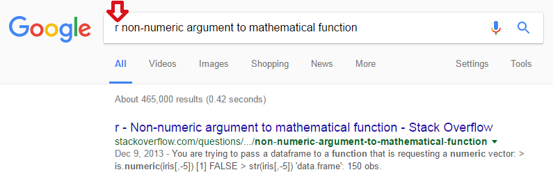
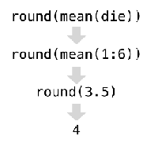
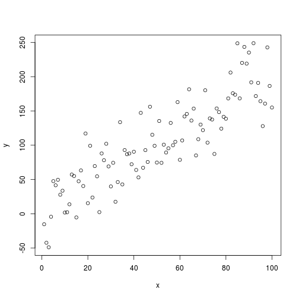
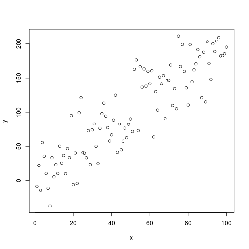
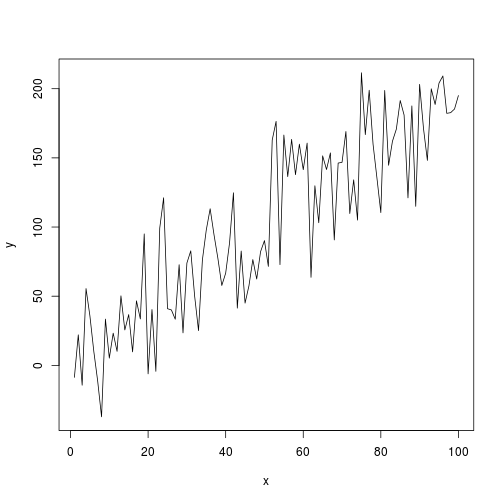
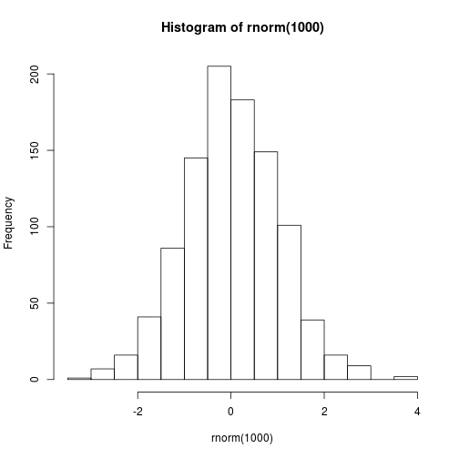
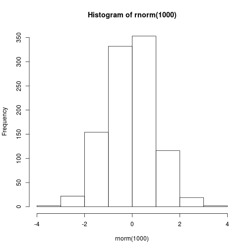

## Introdução

A linguagem `R` é bem intuitiva. É possível fazer bastante coisa à base da tentativa e erro! Além disso, grande parte do conhecimento é escalável, isto é, quando você aprende a utilizar um certo tipo de função, o aprendizado pode ser replicado para funções parecidas. Essa ideia ficará bem clara quando falarmos dos pacotes do `tidyverse`, como o `dplyr` e o `ggplot2`.

Quando o aprendizado não for muito intuitivo ou a utilização de uma função for muito complicada, demandando às vezes conhecimento de Estatística ou Programação, você pode acabar precisando de uma forcinha. Felizmente, a comunidade R é bem ativa, e há várias formas de se conseguir ajuda. Nesta seção, vamos listar algumas dessas maneiras. Em seguida, faremos uma introdução ao RStudio, mostrando as suas principais funcionalidades. Então começaremos a conhecer o R, explorando diversos conceitos básicos.

--------------------------------------------------------------------------------


## Pedindo Ajuda

No R, há quatro principais entidades para se pedir ajuda:

- Help/documentação do R (comandos `help(nome_da_funcao)` ou `?nome_da_funcao`)

- Google

- Stack Overflow

- Coleguinha

A busca por ajuda é feita preferencialmente, mas não necessariamente, na ordem acima.

### Documentação do R

A documentação do R serve para você aprender a usar uma determinada função.


```r
?mean
help(mean)
```

Cinco dicas:

1. Os exemplos no final são particularmente úteis.
2. Leia a seção **Usage** para ter noção de como usar.
3. Os parâmetros estão descritos em **Arguments**. Identifique quais tipos de objetos eles recebem.
4. Caso essa função não atenda às suas necessidades, a seção **See Also** sugere funções relacionadas.
5. Alguns pacotes possuem tutorias de uso mais completos. Esses textos são chamados de `vignettes` e podem ser acessados com a função `vignette(package = 'nomeDoPacote')`. Por exemplo, `vignette(package = 'dplyr')`. Depois de ver a lista de artigos, escolha um nome e rode `vignette(topic = 'nome', package = 'nomeDoPacote')`. Por exemplo, `vignette(topic = 'introduction', package = 'dplyr')`.

### Google

Há uma comunidade gigantesca de usuários de R gerando diariamente uma infinidade de conteúdos e discussões. Não raramente, você irá encontrar discussões sobre o seu problema simplesmente jogando o seu erro no Google. Essa deve ser sua primeira tentativa! Pesquisas em inglês aumentam consideravelmente a chance de encontrar uma resposta.

Exemplo (repare no 'r' adicionado na busca, isso ajuda bastante):


```r
log("5")
## Error in log("5"): non-numeric argument to mathematical function
```



### Stack Overflow

O [Stack Overflow](http://stackoverflow.com/) e o [Stack Overflow em Português](http://pt.stackoverflow.com/) são sites de Pergunta e Resposta amplamente utilizados por todas as linguagens de programação, e o R é uma delas. Nos EUA, chegam até a usar a reputação dos usuários como diferencial no currículo!

Provavelmente o Google lhe indicará uma página deles quando você estiver procurando ajuda. E quando todas as fontes possíveis de ajuda falharem, o Stack Overflow lhe dará o espaço para **criar sua própria pergunta**.

**Um ponto importante**: como fazer uma **boa** pergunta no Stack Overflow?

No site, tem um tutorial com uma lista de boas práticas, [que se encontra aqui](http://pt.stackoverflow.com/help/how-to-ask). Algumas dicas são

- ser conciso;
- ser específico;
- ter mente aberta; e
- ser gentil.

Porém, no caso do R, há outro requisito que vai aumentar muito sua chance de ter uma boa resposta: **exemplinho minimal e reprodutível**.

- Ser **minimal**: usar bancos de dados menores e utilizar pedaços de códigos apenas suficientes para apresentar o seu problema. Não precisa de banco de dados de um milhão de linhas e nem colocar o seu código inteiro para descrever a sua dúvida.

- Ser **reprodutível**: o seu código deve rodar fora da sua máquina. Se você não fornecer uma versão do seu problema que rode (ou que imite seu erro), as pessoas vão logo desistir de te ajudar. Por isso, nunca coloque bancos de dados que só você tem acesso. Use bancos de dados que já vem no R ou disponibilize um exemplo (possivelmente anonimizado) em `.csv` na web para baixar. E se precisar utilizar funções diferentes, coloque as `library`'s correspondentes.

--------------------------------------------------------------------------------


## RStudio

O RStudio é o melhor ambiente de desenvolvimento de códigos em R disponível. Você pode baixá-lo [neste link](https://www.rstudio.com/products/rstudio/download/preview/).

Muitas das ferramentas são aprendidas conforme o uso, e há bons materiais sobre o Rstudio na internet (por exemplo, [esta página](https://csgillespie.github.io/efficientR/set-up.html#rstudio)). Uma funcionalidade importante é a criação de projetos, permitindo dividir o trabalho em múltiplos ambientes, cada um com o seu diretório, documentos e *workspace*. A seguir, apresentamos algumas estruturas para a organização de um projeto.

**Estrutura 1**. Por extensão de arquivo.


```bash
nome_do_projeto/
  - .Rprofile   # códigos para rodar assim que abrir o projeto
  - R/          # Código R, organizado com a-carrega.R, b-prepara bd.R, c-vis.R, d-modela, ...
  - RData/      # Dados em formato .RData
  - csv/        # Dados em .csv
  - png/        # gráficos em PNG
  - nome_do_projeto.Rproj
```

**Estrutura 2**. Típico projeto de análise estatística.


```bash
project/
  - README.Rmd   # Descrição do pacote
  - set-up.R     # Pacotes etc
  - R/           # Código R, organizado com 0-load.R, 1-tidy.R, 2-vis.R, ...
  - data/        # Dados (estruturados ou não)
  - figures/     # gráficos (pode ficar dentro de output/)
  - output/      # Relatórios em .Rmd, .tex etc
  - project.Rproj
```

**Estrutura 3**. Pacote do R (avançado).


```bash
project/
  - README.md    # Descrição do pacote
  - DESCRIPTION  # Metadados estruturados do pacote e dependências
  - NAMESPACE    # importações e exportações do pacote
  - vignettes/   # Relatórios em .Rmd
  - R/           # Funções do R
  - data/        # Dados estruturados (tidy data)
  - data-raw/    # Dados não estruturados e arqs 0-load.R, 1-tidy.R, 2-vis.R, ...
  - project.Rproj
```

Ao abrir o RStudio, você verá 4 quadrantes. Observe a figura abaixo.


Esses quadrantes representam o **editor**, o **console**, o **environment** e o **output**.  Eles vêm nesta ordem, e depois você pode organizá-los da forma que preferir.

Listamos abaixo as funções dos principais paineis:

- **Editor/Scripts**: é onde escrevemos nossos códigos.
- **Console**: é onde rodamos o código e recebemos as saídas. O R vive aqui!
- **Environment**: painel com todos os objetos criados na sessão.
- **Files**: mostra os arquivos no diretório de trabalho. É possível navegar entre diretórios.
- **Plots**: painel onde os gráficos serão apresentados.
- **Help**: janela onde a documentação das funções serão apresentadas.
- **History**: painel com um histórico dos comandos rodados.

Conhecer atalhos ajuda bastante quando estamos programando no RStudio. Veja os principais:

- **CTRL+ENTER**: roda a linha selecionada no script. Os atalhos mais utilizado.
- **ALT+-**: (<-) sinal de atribuição. Você usará o tempo todo.
- **CTRL+SHIFT+M**: (%>%) operador *pipe*. Guarde esse atalho, você usará bastante.
- **CTRL+1**: altera cursor para o script.
- **CTRL+2**: altera cursor para o console.
- **CTRL+ALT+I**: cria um chunk no R Markdown.
- **ALT+SHIFT+K**: janela com todos os atalhos disponíveis.

--------------------------------------------------------------------------------


## R Markdown

O R Markdown é um tipo de documento especial que contém tanto textos quanto códigos em R, tudo escrito no mesmo lugar. 

O *markdown* nada mais é do que um documento de texto com alguns padrões básicos de formatação, como negrito, itálico, títulos, subtítulos, itens e referências cruzadas. Já os *chunks* são pedaços de códigos em R encapsulados por três crases (```). Os códigos são executados sempre que o documento é processado.


```
## ```{r}
## isto é um chunk. 
## ```
```

<div class='admonition note'>
<p class='admonition-title'>
Nota
</p>
<p>
Este site foi escrito em R Markdown. Toda vez que aparecer exemplos de código de R, havia um chunk no .Rmd original.
</p>
</div>

Para produção de relatórios, o R Markdown possui algumas vantagens, como:

1. **Simplicidade e foco**. Permite ao usuário o foco na análise e não na formatação do documento.
1. **Versátil**. Pode ser utilizado para gerar documentos em $\LaTeX$, `Word`, `HTML` e apresentações em `beamer`, `pptx` e `HTML` (de vários tipos). Pode ainda gerar sites, livros, dissertações de mestrado e até mesmo dashboards interativos.
1. **Reprodutível**. O R Markdown nada mais é que um arquivo de texto. Além disso, ele tenta te obrigar a fazer o documento mais autocontido possível. Assim, um documento `.Rmd` é fácil de compartilhar e de ser utilizado pelo receptor. Lembre-se, o receptor pode ser o futuro você! Vale enfatizar que a reprodutibilidade é considerada como um dos princípios fundamentais da ciência. Então, só de usar R Markdown, você já está colaborando com o método científico. :)
1. **Flexível**. É possível configurar e criar *templates* de análises para quaisquer tipos de aplicações e clientes. Os textos podem ser parametrizados por números que variam de versão para versão, mensalmente, por exemplo, tudo escrito somente em R. 

Criar um R Markdown novo no RStudio é fácil. Clique no botão de criar arquivo e selecione R Markdown.


```r

```


Para detalhes sobre como utilizar o R Markdown, leia o  [r4ds](http://r4ds.had.co.nz/r-markdown.html) e [o tutorial do RStudio](http://rmarkdown.rstudio.com/lesson-1.html).

--------------------------------------------------------------------------------


## Instalar pacotes

O grande trunfo do R são seus pacotes. Assim, fique bastante à vontade para instalar e atualizar muitos e muitos pacotes ao longo da sua experiência com o R.

Existem três principais maneiras de instalar pacotes. Em ordem de frequência, são:

- Via CRAN (Comprehensive R Archive Network): `install.packages("nome-do-pacote")`.
- Via Github: `devtools::install_github("nome-do-repo/nome-do-pacote")`.
- Via arquivo .zip/.tar.gz: `install.packages("C:/caminho/nome-do-pacote.zip", repos = NULL)`.

### Via CRAN

Instale pacotes que não estão na sua biblioteca usando a função `install.packages("nome_do_pacote")`. Por exemplo:


```r
install.packages("magrittr")
```


E, de agora em diante, não precisa mais instalar. Basta carregar o pacote com `library(magrittr)`.

<div class='admonition note'>
<p class='admonition-title'>
Dica!
</p>
<p>
Escreva nome_do_pacote::nome_da_funcao() se quiser usar apenas uma função de um determinado pacote. O operador :: serve para isso. Essa forma também é útil quando se tem duas funções com o mesmo nome e precisamos garantir que o código vá usar a função do pacote correto.
</p>
</div>

### Via Github

Desenvolvedores costumam disponibilizar a última versão de seus pacotes no Github, e alguns deles sequer estão no CRAN. Mesmo assim ainda é possível utilizá-los instalando diretamente pelo github. O comando é igualmente simples:


```r
devtools::install_github("rstudio/shiny")
```

Apenas será necessário o username e o nome do repositório (que geralmente tem o mesmo nome do pacote). No exemplo, o username foi "rstudio" e o repositório foi "shiny". 

Se você não é familiar com o github, não se preocupe! Os pacotes disponibilizados na plataforma geralmente têm um `README` cuja primeira instrução é sobre a instalação. Se não tiver, provavelmente este pacote não te merece! =)

### Via arquivo .zip/.tar.gz

Se você precisar instalar um pacote que está zipado no seu computador (ou em algum servidor), utilize o seguinte comando:


```r
install.packages("C:/caminho/para/o/arquivo/zipapo/nome-do-pacote.zip", repos = NULL)
```

É semelhante a instalar pacotes via CRAN, com a diferença que agora o nome do pacote é o caminho inteiro até o arquivo. O parâmetro `repos = NULL` informa que estamos instalando a partir da máquina local.

A aba ***Packages*** do RStudio também ajuda a administrar os seus pacotes.


--------------------------------------------------------------------------------


## R como calculadora

Pelo console, é possível executar qualquer comando do R.


```r
1:30
##  [1]  1  2  3  4  5  6  7  8  9 10 11 12 13 14 15 16 17 18 19 20 21 22 23
## [24] 24 25 26 27 28 29 30
```

Esse comando é uma forma simplificada de criar um vetor de inteiros de 1 a 30.
Os números que aparecem entre colchetes ([1] e [24]) indicam o índice do primeiro elemento impresso em cada linha.

<div class='admonition note'>
<p class='admonition-title'>
Quando compilamos?
</p>
<p>
Quem vem de linguagens como o C ou Java espera que seja necessário compilar o código em texto para o código das máquinas (geralmente um código binário). No R, isso não é necessário. O R é uma linguagem de programação dinâmica que interpreta o seu código enquanto você o executa.
</p>
</div>

Tente jogar no console `2 * 2 - (4 + 4) / 2`. Pronto! Com essa simples expressão você já é capaz de pedir ao R para fazer qualquer uma das quatro operações aritméticas básicas. A seguir, apresentamos uma lista resumindo como fazer as principais operações no R.


```r
1 + 1    # adição
## [1] 2
4 - 2    # subtração
## [1] 2
2 * 3    # multiplicação
## [1] 6
5 / 3    # divisão
## [1] 1.666667
4 ^ 2    # potência
## [1] 16
5 %% 3   # resto da divisão de 5 por 3
## [1] 2
5 %/% 3  # parte inteira da divisão de 5 por 3
## [1] 1
```

Além do mais, as operações e suas precedências são mantidas como na matemática, ou seja, divisão e multiplicação são calculadas antes da adição e subtração. E os parênteses nunca são demais!

Uma outra forma de executar uma expressão é escrever o código no **editor** e teclar `Ctrl + Enter` ou `Ctrl + R`. Assim, o comando é enviado para o **console**, onde é diretamente executado.

Se você digitar um comando incompleto, como `5 + `, e apertar `Enter`, o R mostrará um `+`, o que não tem nada a ver com somar alguma coisa. Isso significa que o R está esperando que você complete o seu comando. Termine o seu comando ou aperte `Esc` para recomeçar.

```
> 5 -
+ 
+ 5
[1] 0
```

Se você digitar um comando que o R não reconhece, ele retornará uma mensagem de erro. 

NÃO ENTRE EM PÂNICO! 

Ele só está avisando que não conseguiu interpretar o comando. Você pode digitar outro comando normalmente em seguida.

```
> 5 % 5
Error: unexpected input in "5 % 5"
> 5 - 5
[1] 0
```

--------------------------------------------------------------------------------


## Objetos


```r
a <- 1
a
## [1] 1
```

O R te permite salvar dados dentro de um objeto. 

No exemplo acima, salvamos o valor `1` em `a`, e sempre que o R encontrar o nome `a` ele vai substituir por `1`.

<div class='admonition note'>
<p class='admonition-title'>
Atenção!
</p>
<p>
O R entende letras maiúsculas e minúsculas, isto é <b>a</b> é considerado um objeto diferente de <b>A</b>.
</p>
</div>

### Objetos atômicos

Existem cinco classes básicas ou "atômicas" no R:

- character `"UAH!"` (é o varchar do SQL)
- numeric `0.95` (números reais)
- integer `100515` (inteiros)
- complex `2 + 5i` (números complexos, a + bi)
- logical `TRUE` (booleanos, TRUE/FALSE)

### Vetores

Vetores no R são os objetos mais simples que podem guardar objetos atômicos.


```r
vetor <- c(1, 2, 3, 4)
class(vetor)
## [1] "numeric"
```

De forma bastante intuitiva, você pode fazer operações com vetores.


```r
vetor - 1
## [1] 0 1 2 3
```

Quando você faz `vetor - 1`, o R subtrai `1` de cada um dos elementos do vetor. O mesmo acontece quando você faz qualquer operação aritmética com vetores no R. Tente jogar o código abaixo no console.


```r
vetor / 2
vetor * 10
```

Você também pode fazer operações que envolvem mais de um vetor:


```r
vetor * vetor
## [1]  1  4  9 16
```

Neste caso, o R irá alinhar os dois vetores e multiplicar elemento por elemento. Isso pode ficar um pouco confuso quando os dois vetores não possuem o mesmo tamanho:


```r
vetor2 <- 1:3
vetor * vetor2
## Warning in vetor * vetor2: longer object length is not a multiple of
## shorter object length
## [1] 1 4 9 4
```

Agora o R alinhou os dois vetores. Como eles não possuíam o mesmo tamanho, foi repetindo o vetor menor até completar o vetor maior. 

Esse comportamento é chamado de **reciclagem** e é útil para fazer operações *elemento por elemento* (vetorizadamente), mas às vezes pode ser confuso. Com o tempo, você aprenderá a se aproveitar dele.

### Misturando objetos

<div class='admonition note'>
<p class='admonition-title'>
Vetores são homogêneos
</p>
<p>
Os elementos de um vetor são sempre da mesma classe. Ou todos são numéricos, ou são todos character, ou todos são lógicos etc. Não dá para ter um número e um character no mesmo vetor, por exemplo.
</p>
</div>


Se colocarmos duas ou mais classes diferentes dentro de um mesmo vetor, o R vai forçar que todos os elementos passem a pertencer à mesma classe. O número `1.7` viraria `"1.7"` se fosse colocado ao lado de um `"a"`.


```r
y <- c(1.7, "a")  ## character
y <- c(TRUE, 2)   ## numeric
y <- c(TRUE, "a") ## character
```

A ordem de precedência é:

**DOMINANTE** `character > complex > numeric > integer > logical` **RECESSIVO**

### Forçando classes explicitamente

Assim como o `convert()` do SQL faz, você pode coagir um objeto a ser de uma classe da sua escolha com as funções `as.character()`, `as.numeric()`, `as.integer()` e `as.logical()`. 


```r
x <- 0:4
class(x)
## [1] "integer"
as.numeric(x)
## [1] 0 1 2 3 4
as.logical(x)
## [1] FALSE  TRUE  TRUE  TRUE  TRUE
as.character(x)
## [1] "0" "1" "2" "3" "4"
```

Se o R não entender como coagir uma classe na outra, ele soltará um `warning` informado que colocou `NA` no lugar.


```r
x <- c("a", "b", "c")
as.numeric(x)
## Warning: NAs introduced by coercion
## [1] NA NA NA
```

<div class='admonition note'>
<p class='admonition-title'>
Observação
</p>
<p>
O <b>NA</b> tem o mesmo papel que o <b>null</b> do SQL. Porém, há um <b>NULL</b> no R também, com diferenças sutis que vamos abordar mais adiante. Não confundir!
</p>
</div>

### Matrizes

Matrizes são vetores com duas dimensões (e por isso só possuem elementos de uma mesma classe).


```r
m <- matrix(1:6, nrow = 2, ncol = 3)
m
##      [,1] [,2] [,3]
## [1,]    1    3    5
## [2,]    2    4    6
dim(m) # funçăo dim() retorna a dimensăo do objeto.
## [1] 2 3
```

Repare que os números de 1 a 6 foram dispostos na matriz coluna por coluna (*column-wise*), ou seja, preenchendo de cima para baixo e depois da esquerda para a direita.

**Utilidades**


```r
m[3,  ]   # seleciona uma linha
m[ , 2]   # seleciona uma coluna
m[1, 2]   # seleciona um elemento
t(m)      # matriz transposta
m %*% n   # multiplicação matricial
solve(m)  # matriz inversa
```

### Fatores

Fatores podem ser vistos como vetores de inteiros que possuem rótulos (labels).


```r
sexo <- c("M", "H", "H", "H", "M", "M", "H")
fator <- as.factor(sexo)
fator
## [1] M H H H M M H
## Levels: H M
as.numeric(fator)
## [1] 2 1 1 1 2 2 1
```

Eles são úteis para representar uma variável categórica (nominal e ordinal). Na modelagem, eles serão tratados de maneira especial em funções como `lm()` e `glm()`. 

A função `levels()` retorna os rótulos do fator:


```r
levels(fator)
## [1] "H" "M"
```

A ordem das categorias de um fator pode importar. Como exemplo, temos as caselas de referência de modelos estatísticos e a ordem das barras de um gráfico. Para ajudar nesta tarefa, consulte o pacote [forcats](https://github.com/tidyverse/forcats).

<div class='admonition note'>
<p class='admonition-title'>
Um erro comum e desastroso
</p>
<p>
Quando um vetor de números está como <b>factor</b>, ao tentar transformar o vetor em <b>numeric</b>, você receberá um vetor de inteiros que não tem nada a ver com os valores originais!
</p>
</div>


```r
numeros <- factor(c("10", "55", "55", "12", "10", "-5", "-90"))
```

```
as.numeric(numeros)
## [1] 3 5 5 4 3 1 2    # <-- Por essa eu năo esperava!
```

Para evitar isso, use `as.character()` antes de transformar para número.

```
as.numeric(as.character(numeros))
## [1]  10  55  55  12  10  -5 -90   # <-- Agora está OK
```

### Valores especiais

Existem valores reservados para representar dados faltantes, infinitos, e indefinições matemáticas.

- **NA** (Not Available) significa dado faltante/indisponível. É o `null` do SQL ou o `.` do SAS. O `NA` tem uma classe, ou seja, podemos ter `NA` numeric, `NA` character etc.
- **NaN** (Not a Number) representa indefinições matemáticas, como `0/0` e `log(-1)`. Um `NaN` é um `NA`, mas a recíproca não é verdadeira.
- **Inf** (Infinito) é um número muito grande ou o limite matemático, por exemplo, `1/0` e `10^310`. Aceita sinal negativo `-Inf`. 
- **NULL** representa a ausência de informação. Conceitualmente, a diferença entre `NA` e `NULL` é sutil, mas, no R, o `NA` está mais alinhado com os conceitos de estatística (ou como gostaríamos que os dados faltantes se comportassem em análise de dados) e o `NULL` está em sintonia com comportamentos de lógica de programação.
- Use as funções `is.na()`, `is.nan()`, `is.infinite()` e `is.null()` para testar se um objeto é um desses valores.


```r
x <- c(NaN, Inf, 1, 2, 3, NA)
is.na(x)
## [1]  TRUE FALSE FALSE FALSE FALSE  TRUE
is.nan(x)
## [1]  TRUE FALSE FALSE FALSE FALSE FALSE
```

### Listas

Listas são um tipo especial de vetor que aceita elementos de classes diferentes.


```r
x <- list(1:5, "Z", TRUE, c("a", "b"))
x
## [[1]]
## [1] 1 2 3 4 5
## 
## [[2]]
## [1] "Z"
## 
## [[3]]
## [1] TRUE
## 
## [[4]]
## [1] "a" "b"
```

É um dos objetos mais importantes para armazenar dados e vale a pena saber manuseá-los bem. Existem muitas funções que fazem das listas objetos incrivelmente úteis.

Criamos uma lista pela função `list()`, que aceita um número arbitrário de elementos. Listas aceitam QUALQUER tipo de objeto. Podemos ter listas dentro de listas, por exemplo. Como para quase todos os objetos no R, as funções `is.list()` e `as.list()` também existem.

Na lista `pedido` abaixo, temos `numeric`, `Date`, `character`, vetor de `character` e `list` contida em uma lista:


```r
pedido <- list(pedido_id = 8001406,
               pedido_registro = as.Date("2016-12-12"),
               nome = "Athos", 
               sobrenome = "Petri Damiani", 
               cpf = "12345678900", 
               email = "athos.damiani@gmail.com", 
               qualidades = c("incrível", "impressionante"),
               itens = list(
                 list(descricao = "Ferrari", 
                      frete = 0, 
                      valor = 500000),
                 list(descricao = "Dolly", 
                      frete = 1.5, 
                      valor = 3.90)
               ), 
               endereco = list(entrega = list(logradouro = "Rua da Glória", 
                                              numero = "123",
                                              complemento = "apto 71"),
                               cobranca = list(logradouro = "Rua Jose de Oliveira Coutinho",
                                               numero = "151",
                                               complemento = "5o andar")
               )
)
```

**Utilidades**


```r
pedido$cpf     # elemento chamado 'cpf'
pedido[1]      # nova lista com apenas o primeiro elemento
pedido[[2]]    # segundo elemento
pedido["nome"] # nova lista com apenas o elemento chamado 'nome'
```

Certamente você se deparará com listas quando for fazer análise de dados com o R. Nos tópicos mais aplicados, iremos aprofundar sobre o tema. O pacote [purrr](https://github.com/hadley/purrr) contribui com funcionalidades incríveis para listas.

### data.frame

Um `data.frame` é o mesmo que uma tabela do SQL ou um spreadsheet do Excel, por isso são objetos muito importantes. 

Usualmente, seus dados serão importados para um objeto `data.frame`. Em grande parte do curso, eles serão o principal objeto de estudo.

`data.frame`'s são listas especiais em que todos os seus elementos possuem **o mesmo comprimento**. Cada elemento dessa lista pode ser pensado como uma coluna da tabela. Seu comprimento representa o número de linhas. 

Já que são listas, essas colunas podem ser de classes diferentes. Essa é a grande diferença entre `data.frame`'s e matrizes. Algumas funções úteis:

- `head()` - Mostra as primeiras 6 linhas.
- `tail()` - Mostra as últimas 6 linhas.
- `dim()` - Número de linhas e de colunas.
- `names()` - Os nomes das colunas (variáveis).
- `str()` - Estrutura do data.frame. Mostra, entre outras coisas, as classes de cada coluna.
- `cbind()` - Acopla duas tabelas lado a lado.
- `rbind()` - Empilha duas tabelas.

O exemplo abaixo mostra que uma lista pode virar `data.frame` se todos os elementos tiverem o mesmo comprimento.


```r
minha_lista <- list(x = c(1, 2, 3), y = c("a", "b"))
as.data.frame(minha_lista)
## Error in (function (..., row.names = NULL, check.rows = FALSE, check.names = TRUE, : arguments imply differing number of rows: 3, 2
```


```r
minha_lista <- list(x = c(1, 2, 3), y = c("a", "b", "c"))
as.data.frame(minha_lista)
##   x y
## 1 1 a
## 2 2 b
## 3 3 c
```

#### Exemplo de data.frame: iris {-}


```r
head(iris)  
##   Sepal.Length Sepal.Width Petal.Length Petal.Width Species
## 1          5.1         3.5          1.4         0.2  setosa
## 2          4.9         3.0          1.4         0.2  setosa
## 3          4.7         3.2          1.3         0.2  setosa
## 4          4.6         3.1          1.5         0.2  setosa
## 5          5.0         3.6          1.4         0.2  setosa
## 6          5.4         3.9          1.7         0.4  setosa
str(iris)
## 'data.frame':	150 obs. of  5 variables:
##  $ Sepal.Length: num  5.1 4.9 4.7 4.6 5 5.4 4.6 5 4.4 4.9 ...
##  $ Sepal.Width : num  3.5 3 3.2 3.1 3.6 3.9 3.4 3.4 2.9 3.1 ...
##  $ Petal.Length: num  1.4 1.4 1.3 1.5 1.4 1.7 1.4 1.5 1.4 1.5 ...
##  $ Petal.Width : num  0.2 0.2 0.2 0.2 0.2 0.4 0.3 0.2 0.2 0.1 ...
##  $ Species     : Factor w/ 3 levels "setosa","versicolor",..: 1 1 1 1 1 1 1 1 1 1 ...
```

--------------------------------------------------------------------------------


## Controles de Fluxo

Como toda boa linguagem de programação, o R possui estruturas de `if`'s, `else`'s, `for`'s, `while`'s etc. Esses **controles de fluxo** são importantes na hora de programar. 

### IF e ELSE

O seguinte trecho de código só será executado se o objeto `x` for igual a 1. Repare que a condição de igualdade é representada por dois iguais (==).


```r
x <- 2

if(x == 1) {         
  Sys.time()      # Devolve a data/hora no momento da execução.
}
```


```r
x <- 1

if(x == 1) {
  Sys.time()
}
## [1] "2017-06-22 00:45:40 UTC"
```

O R só vai executar o que está na expressão dentro das chaves `{}` se o que estiver dentro dos parênteses `()` retornar `TRUE`.

A sintaxe com o `else` e o `if else` é


```r
if(x < 0) {
  
  sinal <- "negativo"
  
} else if(x == 0) {
  
  sinal <- "neutro"
  
} else if(x > 0) {
  
  sinal <- "positivo"
}

sinal
## [1] "positivo"
```

<div class='admonition note'>
<p class='admonition-title'>
Diferença entre SQL e R nas comparações lógicas
</p>
<p>
<b>Igualdade</b>: no SQL é só um sinal de igual: <2 = 1. No R são dois: 2 == 1.
<br>
<b>Diferença</b>: teste de diferente no R é != em vez de de <>.
<br>
<b>Negação</b>: em vez de usar a palavra "not" igual ao SQL, usamos !. Por exemplo, "entidade_id not in ('100515')" fica "!entidade_id %in% c('100515')".
</p>
</div>


### for

Vamos usar o `for` para somar todos os elementos de um vetor.


```r

x <- 1:10   # Cria um vetor com a sequência 1, 2, ..., 10.
soma <- 0

for(i in 1:10) {
  soma <- soma + x[i]
}

soma
## [1] 55
```

De forma equivalente, podemos usar diretamente a função `sum()`.


```r
sum(x)
## [1] 55
```

Agora, vamos imprimir na tela o resultado da divisão de cada elemento de um vetor por dois. Para isso, utilizaremos a função `print()`.


```r
vetor <- 30:35
indices <- seq_along(vetor) # cria o vetor de índices segundo o tamanho 
                            # do objeto vetor.   
for(i in indices) {
  print(vetor[1:i] / 2)
}
## [1] 15
## [1] 15.0 15.5
## [1] 15.0 15.5 16.0
## [1] 15.0 15.5 16.0 16.5
## [1] 15.0 15.5 16.0 16.5 17.0
## [1] 15.0 15.5 16.0 16.5 17.0 17.5
```

No trecho de código acima, preste atenção no resultado individual de cada uma das operações para entender como o R funciona.

Para finalizar, listamos na tabela abaixo os principais operadores lógicos.


|Operador   |Descrição                                 |
|:----------|:-----------------------------------------|
|x < y      |x menor que y?                            |
|x <= y     |x menor ou igual a y?                     |
|x > y      |x maior que y?                            |
|x >= y     |x maior ou igual a y?                     |
|x == y     |x igual a y?                              |
|x != y     |x diferente de y?                         |
|!x         |Negativa de x                             |
|x &#124; y |x ou y são verdadeiros?                   |
|x & y      |x e y são verdadeiros?                    |
|xor(x, y)  |x ou y são verdadeiros (apenas um deles)? |

--------------------------------------------------------------------------------


## Funções

O R vem com muitas funções implementadas com as quais você pode fazer muitas  tarefas complicadas, como gerar números aleatórios. Geralmente, o nome das funções é bem intuitivo, por exemplo, `mean` é a função que calcula a média, `round` é a função que arredonda um número etc.


```r
round(5.634)
## [1] 6
```

Para entender melhor o funcionamento das funções no R, considere o seguinte exemplo:


```r
die <- 1:6
round(mean(die))
## [1] 4
```

A ilustração abaixo mostra o que acontece quando você executa `round(mean(die))` no R.



Passamos dados para as funções por meio de argumentos. No R, esses argumentos estão documentados na página de ajuda de cada uma das funções, que pode ser acessada digitando `help(nome_da_funcao)` ou `?nome_da_funcao`.

### Criando suas próprias funções

Sintaxe:


```r
soma <- function(x, y = 0) {
  resposta <- x + y
  return(resposta)
}
```

A função acima tem:

- o nome `soma`;
- os argumentos `x` e `y`;
- o corpo `resposta <- x + y`; e
- o valor padrão `0` para o argumento `y` (`y = 0`).

Use-a como qualquer outra função:


```r
soma(2, 1) # soma de 2 + 1
## [1] 3
soma(2) # soma de 2 + 0
## [1] 2
```

O argumento `y` possui o valor padrão `0`. Isso quer dizer que ele valerá zero caso o usuário não passe um valor explicitamente.

O [Advanced-R](http://adv-r.had.co.nz/) é um excelente livro para quem quiser masterizar a arte de se fazer funções. 

--------------------------------------------------------------------------------


## Fórmulas


```r
formula <- y ~ x1 + x2
class(formula)
## [1] "formula"
```

Fórmulas são coisas do tipo `y ~ x`. As funções as usam de maneiras diversas, mas o exemplo mais emblemático vem da modelagem estatística.

A função `lm()` é a que ajusta uma regressão linear no R, e `lm(y ~ x)` lê-se "regressão linear de y explicada por x".


```r
minha_formula <- Sepal.Width ~ Petal.Length + Petal.Width
class(minha_formula)
## [1] "formula"
lm(minha_formula, data = iris)
## 
## Call:
## lm(formula = minha_formula, data = iris)
## 
## Coefficients:
##  (Intercept)  Petal.Length   Petal.Width  
##       3.5870       -0.2571        0.3640
```

No caso específico das regressões lineares, são nas fórmulas que conseguimos descrever as variáveis explicativas e suas interações. A fórmula `y ~ x1 * x2` significa "y regredido por x1, x2 e a interação entre x1 e x2". Fórmulas aparecem frequentemente em tarefas de modelagem.

Demais usos de fórmulas aparecerão em outras funções (como o `ggplot`) com outros significados, e a documentação nos dirá como usá-las.

--------------------------------------------------------------------------------


## Gráficos (base)

O R já vem com funções básicas que fazem gráficos estatísticos de todas as naturezas. 

- Vantagens: são rápidas e simples.
- Desvantagens: são feias e difíceis para gerar gráficos complexos.

### Gráfico de dispersão

**Funçăo** `plot()`

Parâmetros principais (ver `help(hist)` para mais detalhes):

- `x`, `y` - Vetores para representarem os eixos x e y.
- `type` -  Tipo de gráfico. Pode ser pontos, linhas, escada etc.

<div class='admonition note'>
<p class='admonition-title'>
Atenção!
</p>
<p> 
Além de gerar gráficos de dispersão, tentar chamar a função <b>plot(objeto_diferentao)<b> para qualquer tipo de objeto do R geralmente sai um gráfico interessante! Sempre tente fazer isso, a menos que seu objeto seja um <b>data.frame<b> com milhares de colunas!!!
</p>
</div>


```r
n <- 100
x <- 1:n
y <- 5 + 2 * x + rnorm(n, sd = 30)
plot(x, y)
```



O parâmetro `type = "l"` indica que queremos que os pontos sejam interligados por linhas.


```r
plot(x, y, type = "l")
```


### Histograma

**Funçăo** `hist()`

Parâmetros principais (ver `help(hist)` para mais detalhes):

- `x` - O vetor numérico pra histogramar.
- `breaks` - O número (aproximado) de retângulos.


```r
hist(rnorm(1000))
```


### Boxplot

**Função** `boxplot()`

Parâmetros principais (ver `help(boxplot)` para mais detalhes):

**Uma variável**


```r
boxplot(InsectSprays$count, col = "lightgray")
```



**Duas variáveis** - Usamos fórmula e o parâmetro `data`!


```r
boxplot(count ~ spray, data = InsectSprays, col = "lightgray")
```



### Gráfico de barras

**Função** `table()`, `barplot()`

Primeiro crie uma tabela de frequências (ou qualquer outro sumário). Então crie o gráfico com `barplot()`.

**Tabela com uma variável** usando `table()`.


```r
data(diamonds, package = "ggplot2")
tabela <- table(diamonds$color)
tabela
## 
##     D     E     F     G     H     I     J 
##  6775  9797  9542 11292  8304  5422  2808
barplot(tabela)
```



**Tabela com duas variáveis** em uma tabela de dupla entrada.


```r
VADeaths
##       Rural Male Rural Female Urban Male Urban Female
## 50-54       11.7          8.7       15.4          8.4
## 55-59       18.1         11.7       24.3         13.6
## 60-64       26.9         20.3       37.0         19.3
## 65-69       41.0         30.9       54.6         35.1
## 70-74       66.0         54.3       71.1         50.0
barplot(VADeaths) 
```



--------------------------------------------------------------------------------


<script src="https://cdn.datacamp.com/datacamp-light-latest.min.js"></script>


<script src="https://cdn.datacamp.com/datacamp-light-latest.min.js"></script>


1. Calcule o número de ouro no R.

$$ \frac{1 + \sqrt{5}}{2} $$

<div data-datacamp-exercise data-height="300" data-encoded="true">eyJsYW5ndWFnZSI6InIiLCJzYW1wbGUiOiIjIERpZ2l0ZSBhIGV4cHJlc3NcdTAwZTNvIHF1ZSBjYWxjdWxhIG8gblx1MDBmYW1lcm8gZGUgb3Vyby4iLCJzb2x1dGlvbiI6IiMgRGlnaXRlIGEgZXhwcmVzc1x1MDBlM28gcXVlIGNhbGN1bGEgbyBuXHUwMGZhbWVybyBkZSBvdXJvLlxuKDEgKyBzcXJ0KDUpKS8yIiwic2N0IjoidGVzdF9vdXRwdXRfY29udGFpbnMoXCIxLjYxODAzNFwiLCBpbmNvcnJlY3RfbXNnID0gXCJUZW0gY2VydGV6YSBkZSBxdWUgaW5kaWNvdSBhIGV4cHJlc3NcdTAwZTNvIGNvcnJldGFtZW50ZT9cIilcbnN1Y2Nlc3NfbXNnKFwiQ29ycmV0byFcIikifQ==</div>


2. O que dá divisão de 1 por 0 no R? E -1 por 0? 

<div data-datacamp-exercise data-height="300" data-encoded="true">eyJsYW5ndWFnZSI6InIiLCJzYW1wbGUiOiIgMS8wXG4tMS8wIiwic2N0IjoidGVzdF9vdXRwdXRfY29udGFpbnMoXCJJbmZcIiwgaW5jb3JyZWN0X21zZyA9IFwiVGVtIGNlcnRlemEgZGUgcXVlIGluZGljb3UgYSBleHByZXNzXHUwMGUzbyBjb3JyZXRhbWVudGU/XCIpXG50ZXN0X291dHB1dF9jb250YWlucyhcIi1JbmZcIiwgaW5jb3JyZWN0X21zZyA9IFwiVGVtIGNlcnRlemEgZGUgcXVlIGluZGljb3UgYSBleHByZXNzXHUwMGUzbyBjb3JyZXRhbWVudGU/XCIpXG5zdWNjZXNzX21zZyhcIkNvcnJldG8hXCIpIn0=</div>


3. Quais as diferenças entre `NaN`, `NULL`, `NA` e `Inf`? Digite expressões que
retornam cada um desses resultados.

<div data-datacamp-exercise data-height="300" data-encoded="true">eyJsYW5ndWFnZSI6InIiLCJzYW1wbGUiOiIjIE5hTlxuXG4jIE5VTExcblxuIyBOQVxuXG4jIEluZlxuIiwic29sdXRpb24iOiIjIE5hTiBcdTAwZTkgbyByZXN1bHRhZG8gZGUgdW1hIG9wZXJhXHUwMGU3XHUwMGUzbyBtYXRlbVx1MDBlMXRpY2EgaW52XHUwMGUxbGlkYS4gU2lnbmlmaWNhIE5vdCBBIE51bWJlclxuMC8wXG4jIE5VTEwgXHUwMGU5IG8gdmF6aW8gZG8gUi4gXHUwMGM5IGNvbW8gc2UgbyBvYmpldG8gblx1MDBlM28gZXhpc3Rpc3NlXG5OVUxMXG5hID0gTlVMTFxuaXMubnVsbChpbnRlZ2VyKGxlbmd0aCA9IDApKSAjIHZlamEgcXVlIHVtIHZldG9yLCBtZXNtbyBzZW0gZWxlbWVudG9zIG5cdTAwZTNvIFx1MDBlOSBOVUxMXG4jIE5BIFx1MDBlOSB1bWEgY29uc3RhbnRlIGxcdTAwZjNnaWNhIGRvIFIuIFNpZ2luaWZpY2EgTm90IEF2YWlsbGFibGUuIE5BIHBvZGUgc2VyIFxuIyBjb252ZXJ0aWRvIHBhcmEgcXVhc2UgdG9kb3Mgb3MgdGlwb3MgZGUgdmV0b3JlcyBkbyBSLiBcdTAwYzkgdXNhZG8gcHJpbmNpcGFsbWVudGUgcGFyYVxuIyBpbmRpY2FyIHZhbG9yZXMgZmFsdGFudGVzLlxuTkFcbiMgSW5mIFx1MDBlOSBzaWduaWZpY2EgaW5maW5pdG8uIFx1MDBjOSBvIHJlc3VsdGFkbyBkZSBvcGVyYVx1MDBlN1x1MDBmNWVzIG1hdGVtXHUwMGUxdGljYXMgY3VqbyBsaW1pdGUgXHUwMGU5IGluZmluaXRvLlxuMS8wXG4xL0luZiJ9</div>


4. Tente mentalmente calcular o que dá a conta `5 + 3 * 10 %/% 3 == 15` no R, sem rodar.

5. Adicionando apenas parênteses, faça a expressão acima retornar o resultado contrário.

<div data-datacamp-exercise data-height="300" data-encoded="true">eyJsYW5ndWFnZSI6InIiLCJzYW1wbGUiOiI1ICsgMyAqIDEwICUvJSAzID09IDE1Iiwic29sdXRpb24iOiI1ICsgKDMgKiAxMCkgJS8lIDMgPT0gMTUiLCJzY3QiOiJ0ZXN0X291dHB1dF9jb250YWlucyhcIlRSVUVcIiwgaW5jb3JyZWN0X21zZyA9IFwiVGVtIGNlcnRlemEgZGUgcXVlIGluZGljb3UgYSBleHByZXNzXHUwMGUzbyBjb3JyZXRhbWVudGU/XCIpXG5zdWNjZXNzX21zZyhcIkNvcnJldG8hXCIpIn0=</div>


6. O que acontece se você rodar:


```r
x <- 4
if(x = 4) {
  'isso aqui apareceu'
}
x
```

<div data-datacamp-exercise data-height="300" data-encoded="true">eyJsYW5ndWFnZSI6InIiLCJzYW1wbGUiOiJ4IDwtIDRcbmlmKHggPSA0KSB7XG4gICdpc3NvIGFxdWkgYXBhcmVjZXUnXG59XG54In0=</div>

7. Como você faria para que o código da pergunta anterior fizesse com que `'isso aqui apareceu'` fosse impresso no console, mas nenhum erro aparecesse?

<div data-datacamp-exercise data-height="300" data-encoded="true">eyJsYW5ndWFnZSI6InIiLCJzYW1wbGUiOiJ4IDwtIDRcbmlmKHggPSA0KSB7XG4gICdpc3NvIGFxdWkgYXBhcmVjZXUnXG59XG54Iiwic29sdXRpb24iOiJ4IDwtIDRcbmlmKHggPT0gNCkge1xuICAnaXNzbyBhcXVpIGFwYXJlY2V1J1xufVxueCIsInNjdCI6InRlc3Rfb3V0cHV0X2NvbnRhaW5zKFwiaXNzbyBhcXVpIGFwYXJlY2V1XCIsIGluY29ycmVjdF9tc2cgPSBcIlRlbSBjZXJ0ZXphIGRlIHF1ZSBpbmRpY291IGEgZXhwcmVzc1x1MDBlM28gY29ycmV0YW1lbnRlP1wiKVxudGVzdF9lcnJvcigpXG5zdWNjZXNzX21zZyhcIkNvcnJldG8hXCIpIn0=</div>


--------------------------------------------------------------------------------


<script src="https://cdn.datacamp.com/datacamp-light-latest.min.js"></script>


1. 

<div data-datacamp-exercise data-height="300" data-encoded="true">eyJsYW5ndWFnZSI6InIiLCJzYW1wbGUiOiIoMSArIHNxcnQoNSkpLzIifQ==</div>

2. 

<div data-datacamp-exercise data-height="300" data-encoded="true">eyJsYW5ndWFnZSI6InIiLCJzYW1wbGUiOiIxLzBcbi0xLzAifQ==</div>

3. 

<div data-datacamp-exercise data-height="300" data-encoded="true">eyJsYW5ndWFnZSI6InIiLCJzYW1wbGUiOiIjIE5hTiBcdTAwZTkgbyByZXN1bHRhZG8gZGUgdW1hIG9wZXJhXHUwMGU3XHUwMGUzbyBtYXRlbVx1MDBlMXRpY2EgaW52XHUwMGUxbGlkYS4gU2lnbmlmaWNhIE5vdCBBIE51bWJlclxuMC8wXG4jIE5VTEwgXHUwMGU5IG8gdmF6aW8gZG8gUi4gXHUwMGM5IGNvbW8gc2UgbyBvYmpldG8gblx1MDBlM28gZXhpc3Rpc3NlXG5OVUxMXG5hID0gTlVMTFxuaXMubnVsbChpbnRlZ2VyKGxlbmd0aCA9IDApKSAjIHZlamEgcXVlIHVtIHZldG9yLCBtZXNtbyBzZW0gZWxlbWVudG9zIG5cdTAwZTNvIFx1MDBlOSBOVUxMXG4jIE5BIFx1MDBlOSB1bWEgY29uc3RhbnRlIGxcdTAwZjNnaWNhIGRvIFIuIFNpZ2luaWZpY2EgTm90IEF2YWlsbGFibGUuIE5BIHBvZGUgc2VyIFxuIyBjb252ZXJ0aWRvIHBhcmEgcXVhc2UgdG9kb3Mgb3MgdGlwb3MgZGUgdmV0b3JlcyBkbyBSLiBcdTAwYzkgdXNhZG8gcHJpbmNpcGFsbWVudGUgcGFyYVxuIyBpbmRpY2FyIHZhbG9yZXMgZmFsdGFudGVzLlxuTkFcbiMgSW5mIFx1MDBlOSBzaWduaWZpY2EgaW5maW5pdG8uIFx1MDBjOSBvIHJlc3VsdGFkbyBkZSBvcGVyYVx1MDBlN1x1MDBmNWVzIG1hdGVtXHUwMGUxdGljYXMgY3VqbyBsaW1pdGUgXHUwMGU5IGluZmluaXRvLlxuMS8wXG4xL0luZiJ9</div>

4.

5.

<div data-datacamp-exercise data-height="300" data-encoded="true">eyJsYW5ndWFnZSI6InIiLCJzYW1wbGUiOiI1ICsgKDMgKiAxMCkgJS8lIDMgPT0gMTUifQ==</div>

6. 

<div data-datacamp-exercise data-height="300" data-encoded="true">eyJsYW5ndWFnZSI6InIiLCJzYW1wbGUiOiI+IHggPC0gNFxuPiBpZih4ID0gNCkge1xuRXJybzogJz0nIGluZXNwZXJhZG8gaW4gXCJpZih4ID1cIlxuPiAgICdpc3NvIGFxdWkgYXBhcmVjZXUnXG5bMV0gXCJpc3NvIGFxdWkgYXBhcmVjZXVcIlxuPiB9XG5FcnJvOiAnfScgaW5lc3BlcmFkbyBpbiBcIn1cIlxuPiB4XG5bMV0gNCJ9</div>

7.

<div data-datacamp-exercise data-height="300" data-encoded="true">eyJsYW5ndWFnZSI6InIiLCJzYW1wbGUiOiJ4IDwtIDRcbmlmKHggPT0gNCkge1xuICAnaXNzbyBhcXVpIGFwYXJlY2V1J1xufVxueCJ9</div>

8.

<div data-datacamp-exercise data-height="300" data-encoded="true">eyJsYW5ndWFnZSI6InIiLCJzYW1wbGUiOiJmb3IgKGkgaW4gMTo0KXtcbiAgaWYoaSAlJSAyID09IDApe1xuICAgIHByaW50KHBhc3RlKGksIFwiZWxlZmFudGUocylcIiwgcGFzdGUocmVwKFwiaW5jb21vZGEobSlcIiwgdGltZXMgPSBpKSwgY29sbGFwc2UgPSBcIiBcIiksIFwibXVpdG8gbWFpc1wiKSlcbiAgfSBlbHNlIHtcbiAgIHByaW50KHBhc3RlKGksIFwiZWxlZmFudGUocykgaW5jb21vZGEobSkgbXVpdGEgZ2VudGVcIikpIFxuICB9XG59In0=</div>

9.

<div data-datacamp-exercise data-height="300" data-encoded="true">eyJsYW5ndWFnZSI6InIiLCJzYW1wbGUiOiJ4IDwtIGMoMSwgMjAsIDQwLCA1MCwgNjApIn0=</div>

10.

<div data-datacamp-exercise data-height="300" data-encoded="true">eyJsYW5ndWFnZSI6InIiLCJzYW1wbGUiOiJ4IDwtIHJ1bmlmKDEwMCkifQ==</div>

11.

<div data-datacamp-exercise data-height="300" data-encoded="true">eyJsYW5ndWFnZSI6InIiLCJzYW1wbGUiOiJtZWFuKHgpIn0=</div>

12.

<div data-datacamp-exercise data-height="300" data-encoded="true">eyJsYW5ndWFnZSI6InIiLCJzYW1wbGUiOiJ4IDwtIGMocnVuaWYoOTkpLCBOQSlcbm1lYW4oeCwgbmEucm0gPSBUKSJ9</div>

13.

<div data-datacamp-exercise data-height="300" data-encoded="true">eyJsYW5ndWFnZSI6InIiLCJzYW1wbGUiOiJtZWRpYSA8LSBmdW5jdGlvbih4KXtcbiAgaSA8LSAxXG4gIHRhbWFuaG8gPC0gbGVuZ3RoKHgpXG4gIHNvbWEgPC0gMFxuICBmb3IoaSBpbiAxOnRhbWFuaG8pe1xuICAgIHNvbWEgPC0gc29tYSArIHhbaV1cbiAgfVxuICByZXR1cm4oc29tYS90YW1hbmhvKVxufSJ9</div>

14.

<div data-datacamp-exercise data-height="300" data-encoded="true">eyJsYW5ndWFnZSI6InIiLCJzYW1wbGUiOiJkYWRvIDwtIGZ1bmN0aW9uKCl7XG4gIHNhbXBsZSgxOjYsIDEpXG59In0=</div>

15.

<div data-datacamp-exercise data-height="300" data-encoded="true">eyJsYW5ndWFnZSI6InIiLCJzYW1wbGUiOiJzb21hX2RhZG9zIDwtIGZ1bmN0aW9uKG4pe1xuICBzb21hIDwtIDBcbiAgZm9yKGkgaW4gMTpuKXtcbiAgICBzb21hIDwtIHNvbWEgKyBzYW1wbGUoMTo2LCAxKVxuICB9XG4gIHJldHVybihzb21hKVxufSJ9</div>

16.

<div data-datacamp-exercise data-height="300" data-encoded="true">eyJsYW5ndWFnZSI6InIiLCJzYW1wbGUiOiJyZXN1bHRhZG9zIDwtIGludGVnZXIobGVuZ3RoID0gMTAwMClcbmZvcihpIGluIDE6MTAwMCl7XG4gIHJlc3VsdGFkb3NbaV0gPC0gc29tYV9kYWRvcygzKVxufVxuaGlzdChyZXN1bHRhZG9zKSJ9</div>


